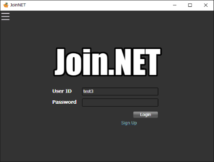
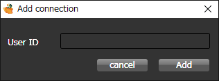
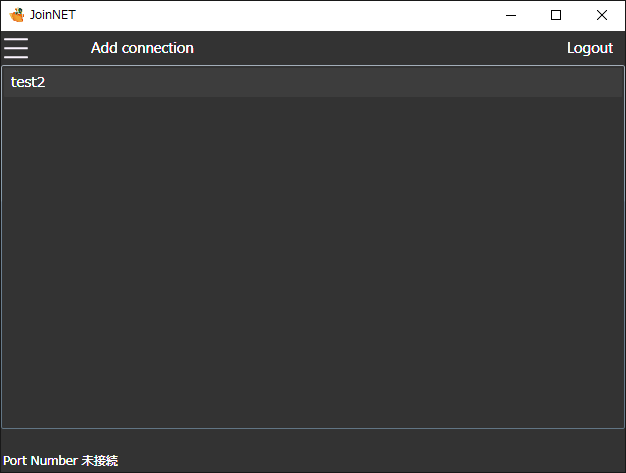
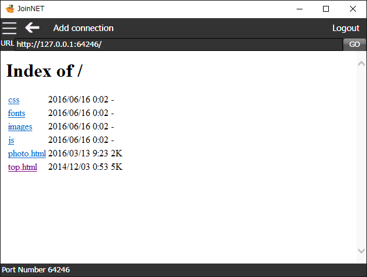

# Join.NET
---
## Introduction
Join.NET is service which connectiong any PCs via internet  
You can connect any protocol via your user ID.  
example, You can connect home web sever from outside of home.  
Also, you can tunneling any protocol, example HTTP, SSH, RDT.  

## How to user
1. Sign up
 To use this software, you need to sign up.  
 Please sign up by URL.  

 https://livechatcof.herokuapp.com/adduser

 If you want to connect 2 PCs , you get 2 user ID.

2. Connect PCs
 1. How to run this software.  
 Click icon 'Join.NET' on desktop  
 2. Login
 After running up software, login to use your user ID and password.  
 

 3. Select 'Add connection' on menu, and add user ID of connection target.  
   

 4. Double click target user ID  
   

 5. After connecting, this software show connection page.  
   
 At default, this software show internal webbrowser. 
 If target setting is 'Any protocol mode', you should connect by any application. 
 Tunneling port is shown at bottom of window.  

## LICENSE
 This sofware is MIT License.
